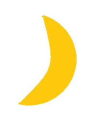
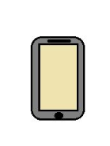
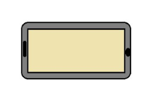
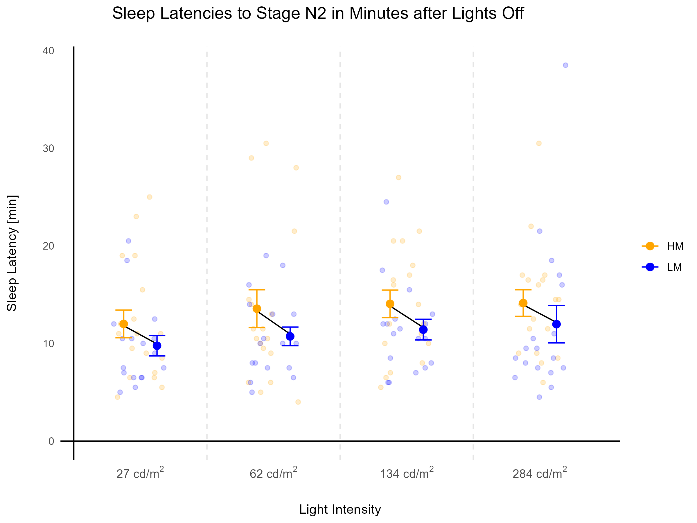

::: text-justify
```{r setup, include=FALSE}
knitr::opts_chunk$set(echo = TRUE)
```

## Background and Motivation

The effects of evening light exposure on sleep have been widely discussed where it is not uncommon for people to be using screens late into the night, often just before going to bed. A recent study found 98.1% of young students reporting electronic device use within 2 hours before bed (Pham et al.2021). This light exposure is thought to reduce the release of the sleep-promoting hormone melatonin (Figuero et al. 2011), effecting circadian rhythms and pushing bedtimes and time taken to fall asleep later. It has further been postulated that both the reduction in screen brightness and increasing the wavelength of light (from blue-light to yellow-light) can attenuate these negative sleep-related effects (van der Lely et al.2015). Colour shifting and brightness software have more recently been marketed to enable individuals to use screens late into the night without the negative effects on sleep.

This data visualisation project used data from a 2023 paper in Nature titled [Melanopic irradiance defines the impact of evening display light on sleep latency, melatonin and alertness](https://www.nature.com/articles/s42003-023-04598-4#Sec8)(Schöllhorn, I., Stefani, O., Lucas, R.J. et al.2023) which looked into the effects of evening light exposure. I used their raw data to visualise findings using r code.

## Setup and Data Origins

First we install and load the packages that are used for this project.

```{r packages, message = FALSE, eval = FALSE}
# Set a CRAN mirror
options(repos = c(CRAN = "https://cran.r-project.org"))


install.packages("tidyverse")
install.packages("readr")
install.packages("ggplot2")
install.packages("here")

# load libraries

library(tidyverse)
library(readr)
library(ggplot2)
library(here)


```

Next we need to load the data into r

```{r import data, eval = FALSE}

data <- read_csv(here("data","sleeplatency_rawdata.csv")) 

```

And then we have a look at the first few lines of the data to ensure it is present

```{r head, message = FALSE, eval = FALSE}

head(data)

```

This data is already organised in long-form, with each variable (Participant, Intensity, Condition, Sleep Latency) displayed along the top row, hence does not need much processing. Long-form data is tidier and is easier to work with in ggplot2.

## Aims

This study aimed to look at the impact of both screen brightness/size and the wavelength on light on alertness, melatonin production and the time taken to fall asleep (sleep latency). This coding project focussed on using data on the time taken to fall asleep after individuals were exposed to evening light of various brightnesses and wavelengths in the 4 hours before lights out (bedtime).

I am personally trying to visualise the results from the raw data in order to produce a plot similar to figure 2 in the paper.

## Codebook

#### 4 Intensities of light were used:

**Intensity 1**: 27 candela per square metre (cd/m2)- similar to that of moonlight

```{r moonlight, echo=FALSE}

```

**Intensity 2**: 62 cd/m2 - similar to that of a smartphone screen

```{r smartphone, echo=FALSE}

```

**Intensity 3:** 134 cd/m2 - similar to that of a tablet screen

```{r tablet, echo=FALSE}

```

**Intensity 4:** 284 cd/m2 - similar to that of a PC screen

```{r PC, echo=FALSE}
knitr::include_graphics("data/PC_image.png")
```

#### 2 Melanopic Conditions were used:

**High Melanopic (HM):** Shorter wavelength light (blue light), thought to reduce and temporally push back melatonin production

```{r HM, echo=FALSE}
knitr::include_graphics("data/HM.png")
```

**Low Melanopic (LM):** Longer wavelength light (orange/yellow light), thought to prevent the reduction in melatonin caused by blue light displays

```{r LM, echo=FALSE}
knitr::include_graphics("data/LM.png")
```

#### Further Definitions:

**N2**: Stage 2 Non-Rapid Eye Movement (REM) sleep.

**Sleep Latency[min]**: The time in minutes taken from lights off for participants to fall asleep and enter the N2 sleep stage.

## Statistics
```{r stats, warning = FALSE, message = FALSE, eval = FALSE}

# stats

# grouping variables by intensity and condition

data_summary <- data %>%
  group_by(Intensity, Condition) %>%
  summarise(
    sleep_latency_mean = mean(sleeplatency, na.rm = TRUE),
    sleep_latency_se = sd(sleeplatency, na.rm = TRUE) / sqrt(n()),
    .groups = 'drop')
 
# creating means of HM and LM so they can be joined by lines 

line_data <- data_summary %>%
  filter(Condition %in% c("HM", "LM")) %>%
  group_by(Intensity) %>%
  summarise(HM_mean = mean(sleep_latency_mean[Condition == "HM"]),
            LM_mean = mean(sleep_latency_mean[Condition == "LM"]))
```

## Data Visualisation

A scatter graph is the best way to visualise the data

```{r data visualisation - scatterplot, warning = FALSE, message = FALSE, eval = FALSE}
  
 #create a plot 
   
   p <- ggplot(data, aes(x = as.factor(Intensity), y = sleeplatency, color = Condition))+
       geom_jitter(width = 0.2, height = 0, alpha = 0.2) +
       scale_color_manual(values = c('orange', 'blue')) +
       labs(title = 'Sleep Latencies to Stage N2 in Minutes after Lights Off',
            x = 'Light Intensity',
            y = 'Sleep Latency [min]') +
       theme_minimal() +
     scale_x_discrete(labels = c(expression("27 cd/m"^2), 
                                 expression("62 cd/m"^2), 
                                 expression("134 cd/m"^2), 
                                 expression("284 cd/m"^2))) +
   geom_hline(yintercept = 0, color = "black") +
   geom_vline(xintercept = 0.5, color = "black") +    
   
      # add lines between means for each condition and intensity
   
     geom_segment(data = line_data,
                  aes(x = as.numeric(as.factor(Intensity)) - 0.15,
                                        xend = as.numeric(as.factor(Intensity)) +
                        0.15, y = HM_mean, yend = LM_mean),
                  color = "black") +
     
   
   # Calculate means and SEMs
     
      
       stat_summary(aes(color = Condition),
                    fun.data = mean_se, geom = 'errorbar',
                    width = 0.25,
                    position = position_dodge(width = 0.5)) +
       stat_summary(aes(fill = Condition),
                    fun.data = mean_se,
                    geom = 'point',
                    size = 3,
                    shape = 16,
                    position = position_dodge(width = 0.5)) +
       scale_fill_manual(values = c('orange', 'blue')) +
       
     geom_vline(xintercept = c(1.5, 2.5, 3.5),
                color = "gray90", linetype = "dashed", size = 0.5) +
     theme(legend.title = element_blank(),
            panel.grid = element_blank(), 
            panel.grid.major = element_blank(),
            panel.grid.minor = element_blank(),
            axis.text.x = element_text(size = 10),
           axis.title.x = element_text(margin = margin(t = 20)),
            axis.title.y = element_text(margin = margin(r = 20)),
           plot.title = element_text(size = 14,hjust = 0.35, margin = margin(b = 20)))
```

Print the plot
```{r print plot, eval = FALSE}
   # Print
   
   p
```


Finally, we save the plot image:
```{r saveplot, eval = FALSE}
  # Save Plot
   
   ggsave(filename = "graphs/sleep_plot.png",
          plot = p, width = 8, height = 6, units = "in", dpi = 300, bg = "white")
```
Here is the graph produced:

```{r sleeplatencyplot, echo=FALSE}


```


## Notes on visualisation

I used [figure 2](https://www.nature.com/articles/s42003-023-04598-4/figures/2) from the paper as inspiration for my visualisation. I ended up playing around a lot with the visualisation, adding colours to the backgrounds and images to the axis, however, I found that many of these add-ons made the plot look too busy and took away from the actual data, hence the plot ended up looking pretty similar to that from the paper. I changed the scattered points of all values to include the blue/orange colour representing the condition so the spread was more clear. Like the original plot, I kept the colouring as orange-blue, both as these represent the wavelengths of light for each condition, but also as this colour combination is colourblind friendly.

## Conclusions

This data indicates that between different light intensities and conditions, there was not a clear difference seen in the average sleep latency. From the paper, the only significant difference was that between HM and LM in the highest intensity condition (284 cd/m2). The spread of data visualised by the scatter points indicates a wide variation in each intensity and condition, suggesting perhaps individuals differences have the larges effect on sleep latency.

They additionally found that melatonin and reported sleepiness levels for each light intensity were significantly higher for LM than HM conditions, indicating that the wavelength of light is effecting melatonin secretion.

Overall, these findings suggest that light exposure does have an effect on sleep linked to melatonin production, particularly the wavelength of light, rather than brightness. However, the actual effects on sleep latency are not significant on average and appear to vary between individuals.

Further research is required to find how the effects of light from screens alone differs from the stimulatory effects of the content on screens e.g. social media before bed, and how this effects the ability to wind-down before bed. 

## Summary

This project was very enjoyable and I learned a lot. I have never used r or coded before so it was a steep learning curve and I feel I still have a lot to learn to unlock the full potential of r and its many packages. 

## References

Figueiro MG, Wood B, Plitnick B, Rea MS. The impact of light from computer monitors on melatonin levels in college students. Neuro Endocrinol Lett. 2011;32(2):158-63. PMID: 21552190.

Pham, H.T.; Chuang, H.-L.; Kuo, C.-P.; Yeh, T.-P.; Liao, W.-C. Electronic Device Use before Bedtime and Sleep Quality among University Students. Healthcare 2021, 9, 1091. https://doi.org/10.3390/healthcare9091091

Schöllhorn, I., Stefani, O., Lucas, R.J. et al. Melanopic irradiance defines the impact of evening display light on sleep latency, melatonin and alertness. Commun Biol 6, 228 (2023). https://doi.org/10.1038/s42003-023-04598-4

:::
